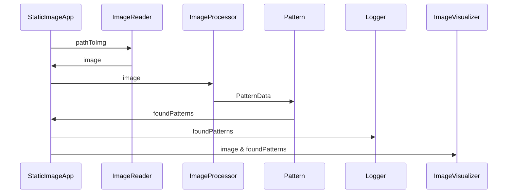
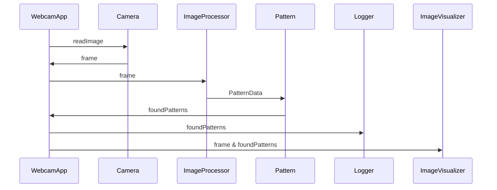

# Real time object and color detection

As part of the [FHGR BSc Mobile Robotics](https://fhgr.ch/mr) an application to detect patterns and their color has been developed
as a group project by [Joshua Stutz](https://github.com/FidibusHex45) and  [Joel Flepp](https://github.com/joel5399) in the 5th
semester. The Project definition is stored [here](./requirements/Software_Engineering_Project_Definition_V1.pdf).

## structure documentation
This README provides a concise overview of the entire project. Further details and information can be found inside the classes.

## Software architecture
### Static image Application architecture


### Webcam Application architecture




## Run Application
There are two options when it comes to execute the application:
1. Load and process a _single_ image from the filesystem [here](./src/app_static_image.py).   
2. _Continously_ load images and process them from a given camera device (such as webcams) [here](./src/app_webcam.py).

The command to start an application should look like this:
```bash
poetry run python .\src\app_webcam.py
```
or
```bash
poetry run python .\src\app_static_image.py
```

The first option is primarily ment for testing purposes. But the process is except for the amount of images exactly the same.

## Read images
The images will be captured using a webcam connected via USB to the laptop where the application will run. For testing purposes you can also run the application with a static image. Detailed information about the implemention can be found [here](./src/common/image_reader.py)

## Main function
As previously mentioned, the primary function of the application is to edit images, search for patterns, and detect their colors. Detailed information about the implementation can be found:
1. Image processing and pattern & color detection [here](./src/common/processor.py)
2. Patterns [here](./documentation/image_processor.md).

## Logging
Another requirement is that all found patterns are logged into a csv. How this is implemented can be found [here](./src/common/logger.py).

## Visualisation
To show whitch patterns are found, a small window will appear and show the found patterns to the user. Further information can be found [here](./src/common/image_visualisation.py).


