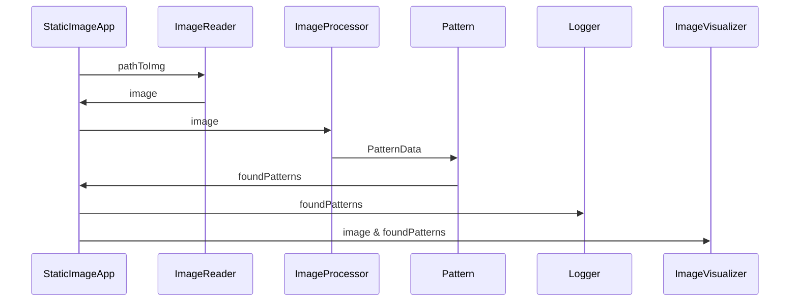
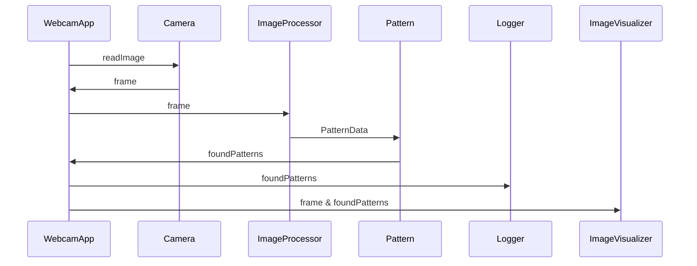

# Real time object and color detection

As part of the [FHGR BSc Mobile Robotics](https://fhgr.ch/mr) an application to detect patterns and their color has been developed
as a group project by [Joshua Stutz](https://github.com/FidibusHex45) and  [Joel Flepp](https://github.com/joel5399) in the 5th
semester. The Project definition is stored [here](./requirements/Software_Engineering_Project_Definition_V1.pdf).

## structure documentation
This README provides a concise overview of the entire project. Further details and information can be found in the project documentation. To navigate thew  the documentation, open [this](./doc/html/index.html) file in your browser.


## Software architecture
### Static image Application architecture


### Webcam Application architecture



## Class diagramms
### Static image class diagramm
``` mermaid
classDiagram
    class StaticImageApp {
    +pathToImage
    +imageProcessor
    +logger
    +imageReader
    +imageVisualizer
    +__init__(self, pathToImage)
    +run(self)
  }

  class ImageReader {
    +__init__(self)
    +readImage(self, pathToImage)
  }

  class ImageVisualizer {
    +lineColor
    +textColor
    +windowName
    +__init__(self, windowName, lineColor, textColor)
    +displayImgWithPatterns(self, frame, foundedPatterns)
    +printFoundedPatterns(self, foundedPatterns)
    -__addContoursToImage(self, frame, foundedPatterns)
  }

  class Logger {
    +tolerance
    +lastFramePatterns
    +columnNames
    +columnNames
    +writer
    +__init__(self, columnNames, tolerance)
    +logDataFromPattern(self, patterns)
    -__writeLogFile(self, logData, firstRow)
    -__checkLogData(self, logData)
    -__getDateTodayTimeNow(self)
    -__PatternAlreadyExists(self, patternToCheck)
    -__updateLastFramePatterns(self, patterns)
  }

  class Pattern {
    +cornerPoints
    +centerX
    +centerY
    +colorString
    +shapeString
    +__init__(self, cornerPoints, centerX, centerY, 
        colorBGR, colorTypes, shapeTypes)
    +__str__(self)
    -__assignColorClasses(self, colorBGR, colorTypes)
    -__assignShapeClasses(self, cornerPoints, shapeTypes)
    -__getSideRatio(self, cornerPoints)
  }

  class ImageProcessor {
    +originalImage
    +colorData
    +shapeData
    +contours
    +foundPatterns
    +__init__(self)
    +loadImage(self, image)
    +searchForPatterns(self)
    -__loadPatternData(self)
    -__openJsonFile(self, pathToJasonFile)
    -__preImageProcessing(self)
    -__findContours(self)
    -__findCorrectShape(self, contour)
    -__getCenterOfShape(self, shape)
    -__getColorOfShape(self, cx, cy)
    -__createPatterns(self)
    -__findDupplicateShapes(self)
    -__handlingDupplicateShapes(self)
  }

  StaticImageApp --|>  ImageProcessor
  StaticImageApp --|>  Logger
  StaticImageApp --|>  ImageReader
  StaticImageApp --|>  ImageVisualizer
  ImageProcessor --|> Pattern
```
### Webcam class diagramm
``` mermaid
classDiagram
    class WebcamApp {
    +fps
    +imageProcessor
    +logger
    +imageVisualizer
    +cam
    +__init__(self, fps, cameraDevice)
    +run(self)
  }

  class Camera {
    +cameraDevice
    +cam
    +__init__(self,cameraDevice)
    +openCamera(self)
    +readImage(self)
    +closeCamera(self)
  }

  class ImageVisualizer {
    +lineColor
    +textColor
    +windowName
    +__init__(self, windowName, lineColor, textColor)
    +displayImgWithPatterns(self, frame, foundedPatterns)
    +printFoundedPatterns(self, foundedPatterns)
    -__addContoursToImage(self, frame, foundedPatterns)
  }

  class Logger {
    +tolerance
    +lastFramePatterns
    +columnNames
    +columnNames
    +writer
    +__init__(self, columnNames, tolerance)
    +logDataFromPattern(self, patterns)
    -__writeLogFile(self, logData, firstRow)
    -__checkLogData(self, logData)
    -__getDateTodayTimeNow(self)
    -__PatternAlreadyExists(self, patternToCheck)
    -__updateLastFramePatterns(self, patterns)
  }

  class Pattern {
    +cornerPoints
    +centerX
    +centerY
    +colorString
    +shapeString
    +__init__(self, cornerPoints, centerX, centerY, 
        colorBGR, colorTypes, shapeTypes)
    +__str__(self)
    -__assignColorClasses(self, colorBGR, colorTypes)
    -__assignShapeClasses(self, cornerPoints, shapeTypes)
    -__getSideRatio(self, cornerPoints)
  }

  class ImageProcessor {
    +originalImage
    +colorData
    +shapeData
    +contours
    +foundPatterns
    +__init__(self)
    +loadImage(self, image)
    +searchForPatterns(self)
    -__loadPatternData(self)
    -__openJsonFile(self, pathToJasonFile)
    -__preImageProcessing(self)
    -__findContours(self)
    -__findCorrectShape(self, contour)
    -__getCenterOfShape(self, shape)
    -__getColorOfShape(self, cx, cy)
    -__createPatterns(self)
    -__findDupplicateShapes(self)
    -__handlingDupplicateShapes(self)
  }

  WebcamApp --|>  ImageProcessor
  WebcamApp --|>  Logger
  WebcamApp --|>  Camera
  WebcamApp --|>  ImageVisualizer
  ImageProcessor --|> Pattern
```


## Run Application
There are two options when it comes to execute the application:
1. Load and process a _single_ image from the filesystem [here](./src/app_static_image.py).   
2. _Continously_ load images and process them from a given camera device (such as webcams) [here](./src/app_webcam.py).

The command to start an application should look like this:
```bash
poetry run python .\src\app_webcam.py
```
or
```bash
poetry run python .\src\app_static_image.py
```

The first option is primarily ment for testing purposes. But the process is except for the amount of images exactly the same.

## Read images
The images will be captured using a webcam connected via USB to the laptop where the application will run. For testing purposes you can also run the application with a static image. Detailed information about the implemention can be found [here](./src/common/image_reader.py)

## Main function
As previously mentioned, the primary function of the application is to edit images, search for patterns, and detect their colors. Detailed information about the implementation can be found:
1. Image processing and pattern & color detection [here](./src/common/processor.py)
2. Patterns [here](./documentation/image_processor.md).

## Logging
Another requirement is that all found patterns are logged into a csv. How this is implemented can be found [here](./src/common/logger.py).

## Visualisation
To show whitch patterns are found, a small window will appear and show the found patterns to the user. Further information can be found [here](./src/common/image_visualisation.py).


