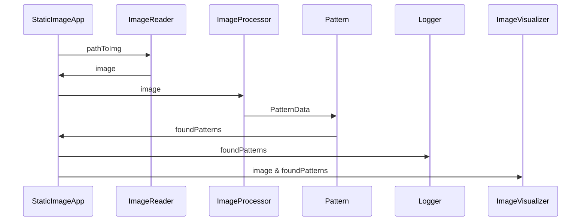
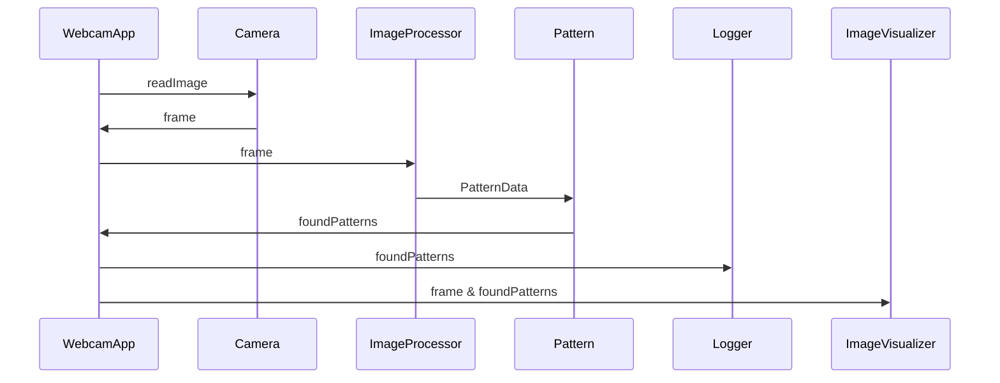

## Static image Application architecture

```mermaid
sequenceDiagram
    participant StaticImageApp
    participant ImageReader
    participant ImageProcessor
    participant Pattern
    participant Logger
    participant ImageVisualizer
    
    
    StaticImageApp->>ImageReader: pathToImg
    ImageReader->>StaticImageApp: image
    StaticImageApp->>ImageProcessor: image
    ImageProcessor->>Pattern: PatternData
    Pattern->>StaticImageApp: foundPatterns
    StaticImageApp->>Logger: foundPatterns
    StaticImageApp->>ImageVisualizer: image & foundPatterns
```

## Webcam Application architecture

```mermaid
sequenceDiagram
    participant WebcamApp
    participant Camera
    participant ImageProcessor
    participant Pattern
    participant Logger
    participant ImageVisualizer
    
    
    WebcamApp->>Camera: readImage
    Camera->>WebcamApp: frame
    WebcamApp->>ImageProcessor: frame
    ImageProcessor->>Pattern: PatternData
    Pattern->>WebcamApp: foundPatterns
    WebcamApp->>Logger: foundPatterns
    WebcamApp->>ImageVisualizer: frame & foundPatterns
```
